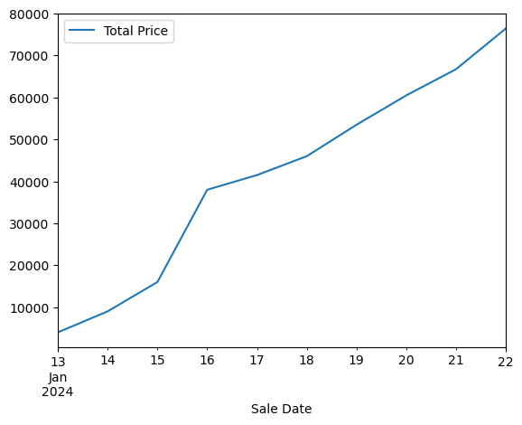
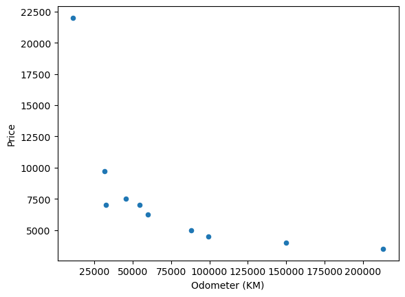
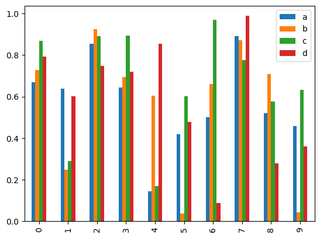
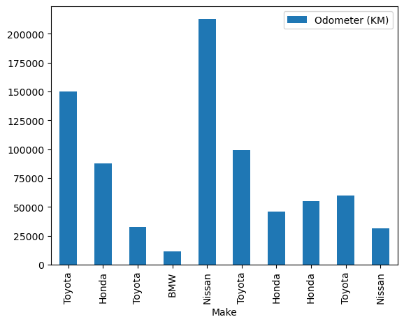
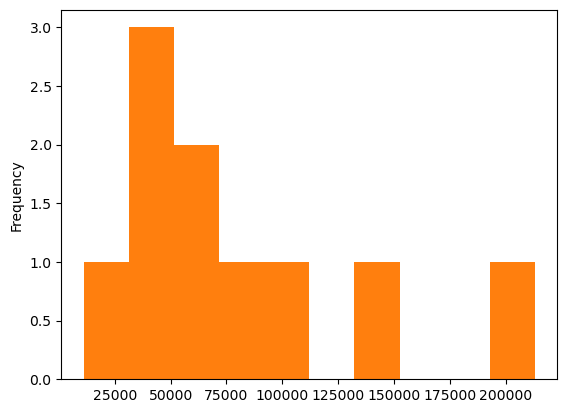
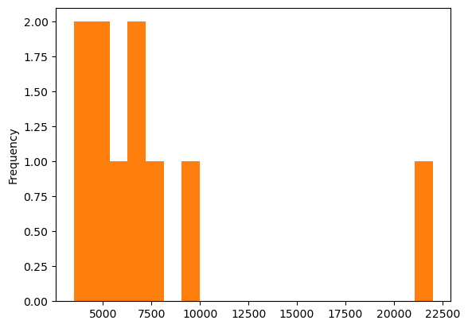

```python
%matplotlib inline
import matplotlib.pyplot as plt
import pandas as pd
import numpy as np
```


```python
# Import the '../data/car-sales.csv' into a DataFame called car_sales and view
car_sales = pd.read_csv('car-sales.csv')
car_sales
```


<div>
<style scoped>
    .dataframe tbody tr th:only-of-type {
        vertical-align: middle;
    }

    .dataframe tbody tr th {
        vertical-align: top;
    }

    .dataframe thead th {
        text-align: right;
    }
</style>
<table border="1" class="dataframe">
  <thead>
    <tr style="text-align: right;">
      <th></th>
      <th>Make</th>
      <th>Colour</th>
      <th>Odometer (KM)</th>
      <th>Doors</th>
      <th>Price</th>
    </tr>
  </thead>
  <tbody>
    <tr>
      <th>0</th>
      <td>Toyota</td>
      <td>White</td>
      <td>150043</td>
      <td>4</td>
      <td>$4,000.00</td>
    </tr>
    <tr>
      <th>1</th>
      <td>Honda</td>
      <td>Red</td>
      <td>87899</td>
      <td>4</td>
      <td>$5,000.00</td>
    </tr>
    <tr>
      <th>2</th>
      <td>Toyota</td>
      <td>Blue</td>
      <td>32549</td>
      <td>3</td>
      <td>$7,000.00</td>
    </tr>
    <tr>
      <th>3</th>
      <td>BMW</td>
      <td>Black</td>
      <td>11179</td>
      <td>5</td>
      <td>$22,000.00</td>
    </tr>
    <tr>
      <th>4</th>
      <td>Nissan</td>
      <td>White</td>
      <td>213095</td>
      <td>4</td>
      <td>$3,500.00</td>
    </tr>
    <tr>
      <th>5</th>
      <td>Toyota</td>
      <td>Green</td>
      <td>99213</td>
      <td>4</td>
      <td>$4,500.00</td>
    </tr>
    <tr>
      <th>6</th>
      <td>Honda</td>
      <td>Blue</td>
      <td>45698</td>
      <td>4</td>
      <td>$7,500.00</td>
    </tr>
    <tr>
      <th>7</th>
      <td>Honda</td>
      <td>Blue</td>
      <td>54738</td>
      <td>4</td>
      <td>$7,000.00</td>
    </tr>
    <tr>
      <th>8</th>
      <td>Toyota</td>
      <td>White</td>
      <td>60000</td>
      <td>4</td>
      <td>$6,250.00</td>
    </tr>
    <tr>
      <th>9</th>
      <td>Nissan</td>
      <td>White</td>
      <td>31600</td>
      <td>4</td>
      <td>$9,700.00</td>
    </tr>
  </tbody>
</table>
</div>


```python
# Try to plot the 'Price' column using the plot() function
car_sales['Price'].plot()
```


    ---------------------------------------------------------------------------

    TypeError                                 Traceback (most recent call last)

    Cell In[33], line 2
          1 # Try to plot the 'Price' column using the plot() function
    ----> 2 car_sales['Price'].plot()


    File ~/Desktop/ml_project/env/lib/python3.13/site-packages/pandas/plotting/_core.py:1030, in PlotAccessor.__call__(self, *args, **kwargs)
       1027             label_name = label_kw or data.columns
       1028             data.columns = label_name
    -> 1030 return plot_backend.plot(data, kind=kind, **kwargs)


    File ~/Desktop/ml_project/env/lib/python3.13/site-packages/pandas/plotting/_matplotlib/__init__.py:71, in plot(data, kind, **kwargs)
         69         kwargs["ax"] = getattr(ax, "left_ax", ax)
         70 plot_obj = PLOT_CLASSES[kind](data, **kwargs)
    ---> 71 plot_obj.generate()
         72 plot_obj.draw()
         73 return plot_obj.result


    File ~/Desktop/ml_project/env/lib/python3.13/site-packages/pandas/plotting/_matplotlib/core.py:499, in MPLPlot.generate(self)
        497 @final
        498 def generate(self) -> None:
    --> 499     self._compute_plot_data()
        500     fig = self.fig
        501     self._make_plot(fig)


    File ~/Desktop/ml_project/env/lib/python3.13/site-packages/pandas/plotting/_matplotlib/core.py:698, in MPLPlot._compute_plot_data(self)
        696 # no non-numeric frames or series allowed
        697 if is_empty:
    --> 698     raise TypeError("no numeric data to plot")
        700 self.data = numeric_data.apply(type(self)._convert_to_ndarray)


    TypeError: no numeric data to plot


### Why doesn't it work?

Hint: It's not numeric data.

In the process of turning it to numeric data, let's create another column which adds the total amount of sales and another one which shows what date the car was sold.

Hint: To add a column up cumulatively, look up the cumsum() function. And to create a column of dates, look up the date_range() function.


```python
# Remove the symbols, 

car_sales['Price'] = car_sales['Price'].str.replace(r'[\$,\.]','',regex=True)
car_sales['Price']
```


    0     400000
    1     500000
    2     700000
    3    2200000
    4     350000
    5     450000
    6     750000
    7     700000
    8     625000
    9     970000
    Name: Price, dtype: object


```python
# convert it to numbers
car_sales['Price']= car_sales['Price'].astype(int)

# final two numbers from the 'Price' column and convert it to numbers
car_sales['Price']= car_sales['Price']//100

car_sales['Price']
```


    0     4000
    1     5000
    2     7000
    3    22000
    4     3500
    5     4500
    6     7500
    7     7000
    8     6250
    9     9700
    Name: Price, dtype: int64


```python
# Add a column called 'Total Sales' to car_sales which cumulatively adds the 'Price' column

car_sales
```


<div>
<style scoped>
    .dataframe tbody tr th:only-of-type {
        vertical-align: middle;
    }

    .dataframe tbody tr th {
        vertical-align: top;
    }

    .dataframe thead th {
        text-align: right;
    }
</style>
<table border="1" class="dataframe">
  <thead>
    <tr style="text-align: right;">
      <th></th>
      <th>Make</th>
      <th>Colour</th>
      <th>Odometer (KM)</th>
      <th>Doors</th>
      <th>Price</th>
    </tr>
  </thead>
  <tbody>
    <tr>
      <th>0</th>
      <td>Toyota</td>
      <td>White</td>
      <td>150043</td>
      <td>4</td>
      <td>4000</td>
    </tr>
    <tr>
      <th>1</th>
      <td>Honda</td>
      <td>Red</td>
      <td>87899</td>
      <td>4</td>
      <td>5000</td>
    </tr>
    <tr>
      <th>2</th>
      <td>Toyota</td>
      <td>Blue</td>
      <td>32549</td>
      <td>3</td>
      <td>7000</td>
    </tr>
    <tr>
      <th>3</th>
      <td>BMW</td>
      <td>Black</td>
      <td>11179</td>
      <td>5</td>
      <td>22000</td>
    </tr>
    <tr>
      <th>4</th>
      <td>Nissan</td>
      <td>White</td>
      <td>213095</td>
      <td>4</td>
      <td>3500</td>
    </tr>
    <tr>
      <th>5</th>
      <td>Toyota</td>
      <td>Green</td>
      <td>99213</td>
      <td>4</td>
      <td>4500</td>
    </tr>
    <tr>
      <th>6</th>
      <td>Honda</td>
      <td>Blue</td>
      <td>45698</td>
      <td>4</td>
      <td>7500</td>
    </tr>
    <tr>
      <th>7</th>
      <td>Honda</td>
      <td>Blue</td>
      <td>54738</td>
      <td>4</td>
      <td>7000</td>
    </tr>
    <tr>
      <th>8</th>
      <td>Toyota</td>
      <td>White</td>
      <td>60000</td>
      <td>4</td>
      <td>6250</td>
    </tr>
    <tr>
      <th>9</th>
      <td>Nissan</td>
      <td>White</td>
      <td>31600</td>
      <td>4</td>
      <td>9700</td>
    </tr>
  </tbody>
</table>
</div>


```python
car_sales['Total Price']= car_sales['Price'].cumsum()
```


```python
car_sales
```


<div>
<style scoped>
    .dataframe tbody tr th:only-of-type {
        vertical-align: middle;
    }

    .dataframe tbody tr th {
        vertical-align: top;
    }

    .dataframe thead th {
        text-align: right;
    }
</style>
<table border="1" class="dataframe">
  <thead>
    <tr style="text-align: right;">
      <th></th>
      <th>Make</th>
      <th>Colour</th>
      <th>Odometer (KM)</th>
      <th>Doors</th>
      <th>Price</th>
      <th>Total Price</th>
    </tr>
  </thead>
  <tbody>
    <tr>
      <th>0</th>
      <td>Toyota</td>
      <td>White</td>
      <td>150043</td>
      <td>4</td>
      <td>4000</td>
      <td>4000</td>
    </tr>
    <tr>
      <th>1</th>
      <td>Honda</td>
      <td>Red</td>
      <td>87899</td>
      <td>4</td>
      <td>5000</td>
      <td>9000</td>
    </tr>
    <tr>
      <th>2</th>
      <td>Toyota</td>
      <td>Blue</td>
      <td>32549</td>
      <td>3</td>
      <td>7000</td>
      <td>16000</td>
    </tr>
    <tr>
      <th>3</th>
      <td>BMW</td>
      <td>Black</td>
      <td>11179</td>
      <td>5</td>
      <td>22000</td>
      <td>38000</td>
    </tr>
    <tr>
      <th>4</th>
      <td>Nissan</td>
      <td>White</td>
      <td>213095</td>
      <td>4</td>
      <td>3500</td>
      <td>41500</td>
    </tr>
    <tr>
      <th>5</th>
      <td>Toyota</td>
      <td>Green</td>
      <td>99213</td>
      <td>4</td>
      <td>4500</td>
      <td>46000</td>
    </tr>
    <tr>
      <th>6</th>
      <td>Honda</td>
      <td>Blue</td>
      <td>45698</td>
      <td>4</td>
      <td>7500</td>
      <td>53500</td>
    </tr>
    <tr>
      <th>7</th>
      <td>Honda</td>
      <td>Blue</td>
      <td>54738</td>
      <td>4</td>
      <td>7000</td>
      <td>60500</td>
    </tr>
    <tr>
      <th>8</th>
      <td>Toyota</td>
      <td>White</td>
      <td>60000</td>
      <td>4</td>
      <td>6250</td>
      <td>66750</td>
    </tr>
    <tr>
      <th>9</th>
      <td>Nissan</td>
      <td>White</td>
      <td>31600</td>
      <td>4</td>
      <td>9700</td>
      <td>76450</td>
    </tr>
  </tbody>
</table>
</div>


```python
# Add a column called 'Sale Date' which lists a series of successive dates starting from today (your today)
car_sales['Sale Date'] = pd.date_range("13/1/2024", periods=len(car_sales))
car_sales
```


<div>
<style scoped>
    .dataframe tbody tr th:only-of-type {
        vertical-align: middle;
    }

    .dataframe tbody tr th {
        vertical-align: top;
    }

    .dataframe thead th {
        text-align: right;
    }
</style>
<table border="1" class="dataframe">
  <thead>
    <tr style="text-align: right;">
      <th></th>
      <th>Make</th>
      <th>Colour</th>
      <th>Odometer (KM)</th>
      <th>Doors</th>
      <th>Price</th>
      <th>Total Price</th>
      <th>Sale Date</th>
    </tr>
  </thead>
  <tbody>
    <tr>
      <th>0</th>
      <td>Toyota</td>
      <td>White</td>
      <td>150043</td>
      <td>4</td>
      <td>4000</td>
      <td>4000</td>
      <td>2024-01-13</td>
    </tr>
    <tr>
      <th>1</th>
      <td>Honda</td>
      <td>Red</td>
      <td>87899</td>
      <td>4</td>
      <td>5000</td>
      <td>9000</td>
      <td>2024-01-14</td>
    </tr>
    <tr>
      <th>2</th>
      <td>Toyota</td>
      <td>Blue</td>
      <td>32549</td>
      <td>3</td>
      <td>7000</td>
      <td>16000</td>
      <td>2024-01-15</td>
    </tr>
    <tr>
      <th>3</th>
      <td>BMW</td>
      <td>Black</td>
      <td>11179</td>
      <td>5</td>
      <td>22000</td>
      <td>38000</td>
      <td>2024-01-16</td>
    </tr>
    <tr>
      <th>4</th>
      <td>Nissan</td>
      <td>White</td>
      <td>213095</td>
      <td>4</td>
      <td>3500</td>
      <td>41500</td>
      <td>2024-01-17</td>
    </tr>
    <tr>
      <th>5</th>
      <td>Toyota</td>
      <td>Green</td>
      <td>99213</td>
      <td>4</td>
      <td>4500</td>
      <td>46000</td>
      <td>2024-01-18</td>
    </tr>
    <tr>
      <th>6</th>
      <td>Honda</td>
      <td>Blue</td>
      <td>45698</td>
      <td>4</td>
      <td>7500</td>
      <td>53500</td>
      <td>2024-01-19</td>
    </tr>
    <tr>
      <th>7</th>
      <td>Honda</td>
      <td>Blue</td>
      <td>54738</td>
      <td>4</td>
      <td>7000</td>
      <td>60500</td>
      <td>2024-01-20</td>
    </tr>
    <tr>
      <th>8</th>
      <td>Toyota</td>
      <td>White</td>
      <td>60000</td>
      <td>4</td>
      <td>6250</td>
      <td>66750</td>
      <td>2024-01-21</td>
    </tr>
    <tr>
      <th>9</th>
      <td>Nissan</td>
      <td>White</td>
      <td>31600</td>
      <td>4</td>
      <td>9700</td>
      <td>76450</td>
      <td>2024-01-22</td>
    </tr>
  </tbody>
</table>
</div>


```python
# Use the plot() function to plot the 'Sale Date' column versus the 'Total Sales' column
car_sales.plot(x="Sale Date", y="Total Price")
plt.show()
```


    

    


```python
# Convert the 'Price' column to the integers
car_sales["Price"] = car_sales["Price"].astype(int)


# Create a scatter plot of the 'Odometer (KM)' and 'Price' column using the plot() function
car_sales.plot(x="Odometer (KM)", y="Price", kind="scatter")

plt.show()

```


    

    


```python
# Create a NumPy array of random numbers of size (10, 4) and save it to X
X = np.random.rand(10, 4)

# Turn the NumPy array X into a DataFrame with columns called ['a', 'b', 'c', 'd']
df = pd.DataFrame(X, columns=["a", "b", "c", "d"])

# Create a bar graph of the DataFrame
df.plot(kind="bar")

plt.show()
```


    

    


```python
# Create a bar graph of the 'Make' and 'Odometer (KM)' columns in the car_sales DataFrame
car_sales.plot(x="Make", y="Odometer (KM)", kind="bar")
plt.show()
```


    

    


```python
# Create a histogram of the 'Odometer (KM)' column
car_sales["Odometer (KM)"].plot(kind="hist")
plt.show()
```


    

    


```python
# Create a histogram of the 'Price' column with 20 bins
car_sales["Price"].plot.hist(bins=20)
plt.show()
```


    

    


```python

```
