```python
# Importing the Header

%matplotlib inline
import matplotlib.pyplot as plt
import numpy as np
```


```python
# Creating a Simple Plot with Random data
np.random.seed(4)
simplePlotData = np.random.randint(1,10,size=(4,4))
simplePlotData

# Creating objects to plot the data
fig, ax = plt.subplots(figsize = (5,5))
ax.plot(simplePlotData)

plt.show()

```


    

    


```python
# Creating a simple python list 
list=[10,20,30,40]
plt.plot(list)
plt.show()
```


    
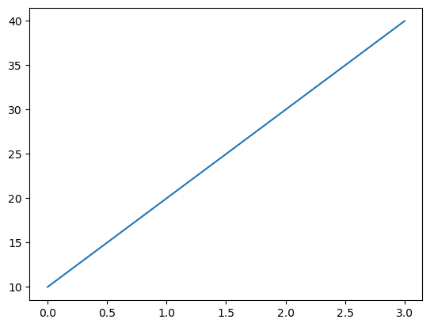
    


```python
# With multiple list x and y
list = [1,2,3,4,5]
list_1=[6,7,8,9,0]

plt.plot(list,list_1)
plt.show()


```


    
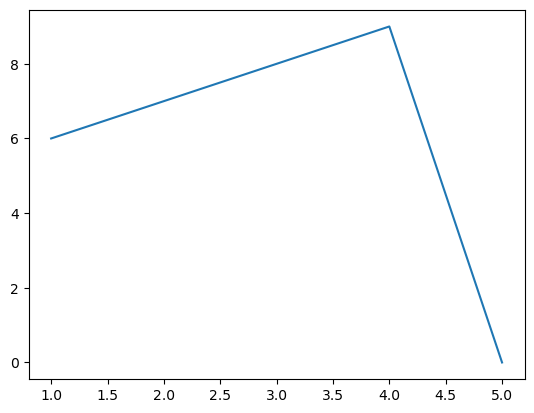
    


```python
# Import and get matplotlib ready
%matplotlib inline
import matplotlib.pyplot as plt

# Prepare data (create two lists of 5 numbers, X & y)
X=[1,2,3,4,5]
y=[3,4,5,6,7]

# Setup figure and axes using plt.subplots()
fig, ax = plt.subplots(figsize=(6,6))

# Add data (X, y) to axes
ax.plot(X,y)

# Customize plot by adding a title, xlabel and ylabel
ax.set(title='Simple Structure',xlabel='x-axis',ylabel='y-axis')

# Showing the figure
plt.show()

# Save the plot to file using fig.savefig()
fig.savefig('simple_structure.png')
```


    
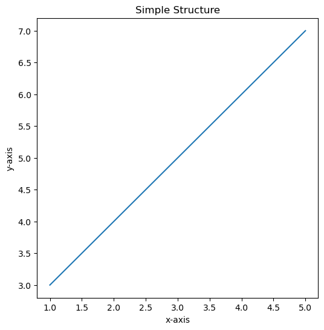
    


```python
# Create an array of 100 evenly spaced numbers between 0 and 100 using NumPy and save it to variable X
even_number = np.arange(0,100,step = 2)

# Create a plot using plt.subplots() and plot X versus X^2 (X squared)
fig, ax = plt.subplots(figsize=(5,5))
ax.plot(even_number,even_number**2)

plt.show()
```


    
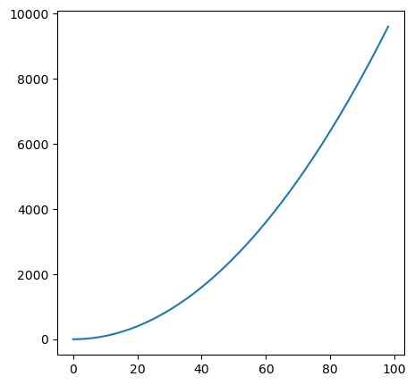
    


```python
# Create a scatter plot of X versus the exponential of X (np.exp(X))
even_number = np.arange(0,100,step = 2)
fig, ax = plt.subplots(figsize=(5,5))

ax.scatter(x=even_number,y=np.exp(even_number))
plt.show()
```


    
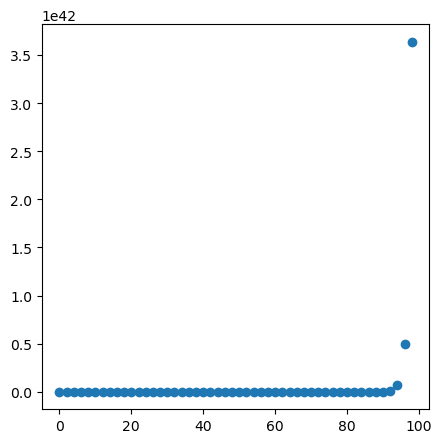
    


```python
# Create a scatter plot of X versus np.sin(X)
even_number = np.arange(0,100,step = 2)
fig, ax = plt.subplots(figsize=(5,5))

ax.scatter(x=even_number,y=np.sin(even_number))
plt.show()
```


    
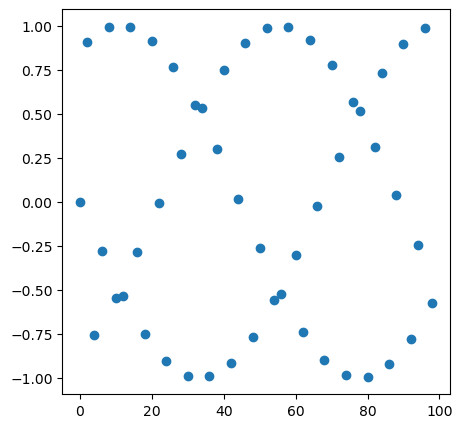
    


```python
# Create a Python dictionary of 3 of  favourite foods with 
favourite_food_prices = {"Almond butter": 10,
                         "Blueberries": 5,
                         "Eggs": 6}

# Create a bar graph where the x-axis is the keys of the dictionary
# and the y-axis is the values of the dictionary
fig, ax = plt.subplots(figsize=(5,5),ncols=1,nrows=1)

ax.bar(favourite_food_prices.keys(),favourite_food_prices.values())

# Add a title, xlabel and ylabel to the plot
ax.set(title='Favourite Food Prices', xlabel='Names',ylabel='Prices')

plt.show()
```


    
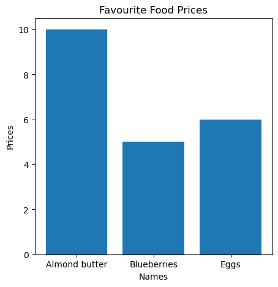
    


```python
# Create a Python dictionary of 3 of  favourite foods with 
favourite_food_prices = {"Almond butter": 10,
                         "Blueberries": 5,
                         "Eggs": 6}

# Create a bar graph where the x-axis is the keys of the dictionary
# and the y-axis is the values of the dictionary
fig, ax = plt.subplots(figsize=(5,5),ncols=1,nrows=1)

ax.barh(favourite_food_prices.keys(),favourite_food_prices.values())

# Add a title, xlabel and ylabel to the plot
ax.set(title='Favourite Food Prices', xlabel='Names',ylabel='Prices')

plt.show()
```


    
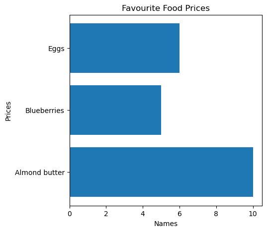
    


```python
# Create a random NumPy array of 1000 normally distributed numbers using NumPy and save it to X
np.random.seed(10)
X = np.random.randn(1000)
X

fig, ax = plt.subplots()
ax.hist(X)

plt.show()
```


    
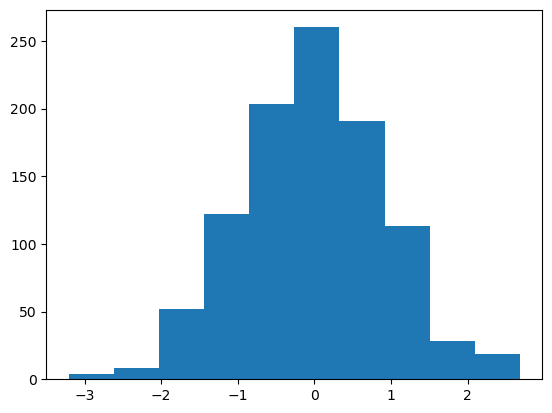
    


```python
# Create a NumPy array of 1000 random numbers and save it to X
X = np.random.random(1000)

# Create a histogram plot of X
fig, ax = plt.subplots()
ax.hist(X)

plt.show()
```


    
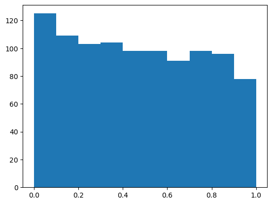
    


```python
# Create an empty subplot with 2 rows and 2 columns (4 subplots total)
fig, ((ax1, ax2), (ax3, ax4)) = plt.subplots(nrows=2,
                                             ncols=2)
plt.show()
```


    
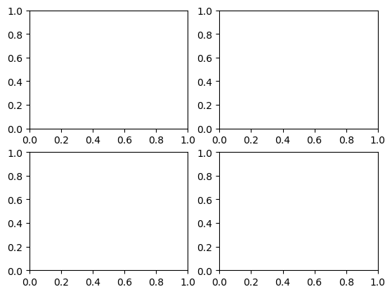
    


```python
# Create the same plot as above with 2 rows and 2 columns and figsize of (10, 5)
fig, ((ax1,ax2),(ax3,ax4)) = plt.subplots(nrows=2,ncols=2,figsize=(10,5))

X = np.random.random(1000)

# Plot X versus X/2 on the top left axes
ax1.plot(X,X/2)

# Plot a scatter plot of 10 random numbers on each axis on the top right subplot
ax2.scatter(np.random.random(10), np.random.random(10))

# Plot a bar graph of the favourite food keys and values on the bottom left subplot
ax3.bar(favourite_food_prices.keys(), favourite_food_prices.values())

# Plot a histogram of 1000 random normally distributed numbers on the bottom right subplot
ax4.hist(np.random.randn(1000));

plt.show()
```


    
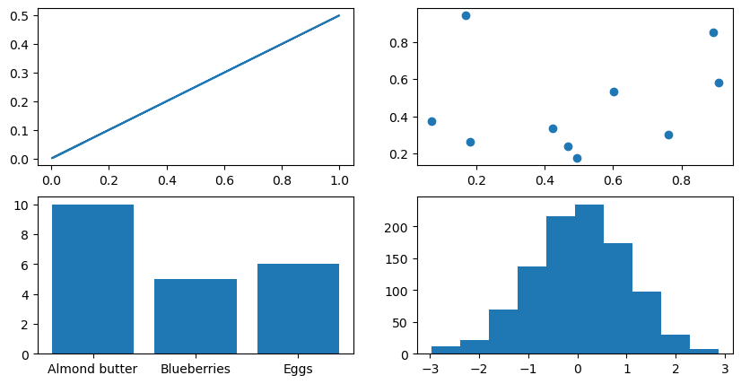
    


```python

```


```python

```


```python

```
